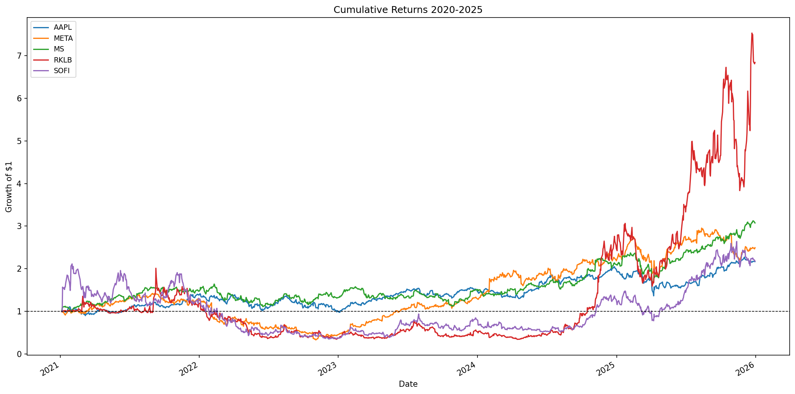
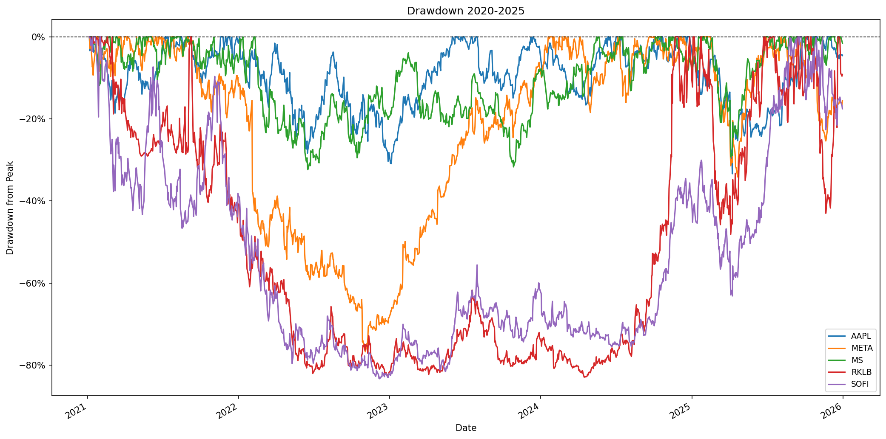
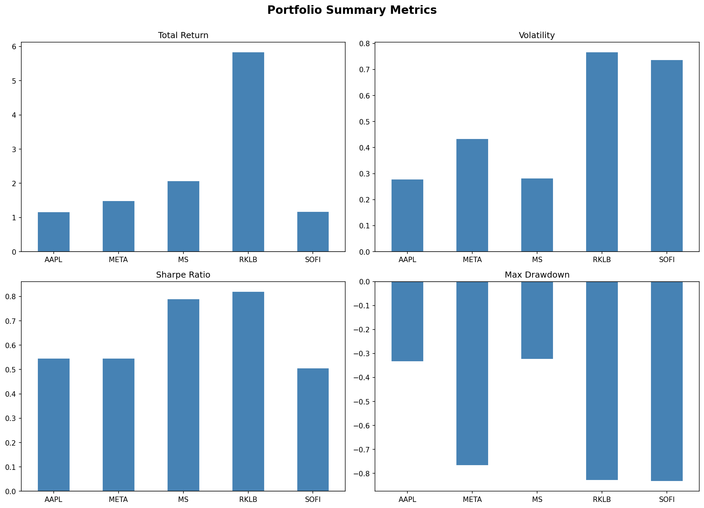

# 📈 Portfolio Performance Dashboard
A Python-based tool that pulls real historical market data and calculates institutional-grade performance metrics for any portfolio of stocks. 
Built as part of my journey learning quantitative finance and Python.

## Features

- User inputs any tickers, date range, portfolio weights, benchmark, and 
  risk-free rate at runtime — no code changes required
- Pulls real adjusted closing prices via Yahoo Finance
- Calculates Total Return, Annualized Volatility, Sharpe Ratio, and Max Drawdown
- Computes a blended weighted portfolio return based on user-defined allocations
- Benchmarks the portfolio against S&P 500, Nasdaq-100, Russell 2000, 
  or Total US Market — user's choice
- Generates 4 visualizations: cumulative returns, drawdown chart, 
  summary metrics dashboard, and correlation heatmap
## Illustration of the Final Output

### Cumulative Returns

### Drawdown Chart

### Summary Metrics

## How to Run

1. Clone this repository or download the files
2. Install the required libraries:
pip install yfinance pandas numpy matplotlib
3. Open `portfolio_dashboard.ipynb` in Jupyter Notebook
4. Run all cells from top to bottom
5. Enter your inputs when prompted:
   - Tickers (e.g. AAPL, MSFT, SPY)
   - Start and end dates (e.g. 2020-01-01 to 2024-12-31)
   - Portfolio weights as percentages (e.g. 40, 30, 30)
   - Benchmark preference (S&P 500, Nasdaq-100, Russell 2000, Total Market)
   - Risk-free rate for Sharpe Ratio calculation

## Tech Stack

- **Python 3**
- **yfinance** — historical market data via Yahoo Finance
- **pandas** — data manipulation and analysis
- **numpy** — financial calculations and statistics
- **matplotlib** — data visualization
